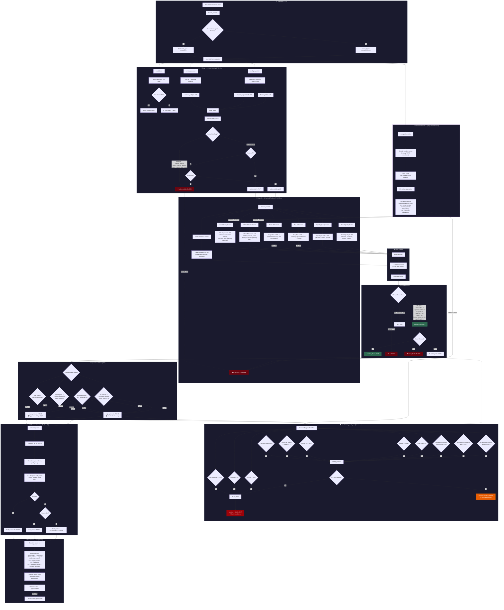

# NXFX01 v2.1 — Complete Scoring Pipeline Diagram

> Generated: March 15, 2026  
> Policy: `scoring_policy.yaml` v2.1  
> Changelog: Added Mempool Features layer, Major Interest gate, enhanced SM/Whale cohort metrics, mempool-based de-risk triggers  

---

---

## Pipeline Phases Summary

| Phase | Timing | Key Decision | Outputs |
|---|---|---|---|
| **Detection** | T+0s | Launchpad classification | `launch_type`, `launch_type_confidence` |
| **Mempool Features** *(v2.1)* | T+0 continuous | Pending tx decode + actor labeling | `MempoolSnapshot` (sm/whale conviction, anomaly density) |
| **Stage 1 — Initial** | T+0–10s | Critical red flag check → FAST/WAIT/BLOCK | `overall_safety_initial`, `action_initial` |
| **CEX Labeling** | T+0–10s | Funding trace ≤2 hops | `is_cex_funded`, `cex_funding_share` |
| **Stage 2 — Behavioral** | T+1–30min | 7 sub-scores + mempool integration | SM, Whale, Graph, Rug, Liquidity, Social, DataConf |
| **Final Scoring** | T+1–30min | Weighted sum × confidence factor | `modulated_score` |
| **FAST Hard Gates** | T+1–30min | 8 circuit breakers | `action_final` (FAST/WAIT/BLOCK) |
| **Major Interest** *(v2.1)* | T+1–30min | Composite institutional interest gate | `major_interest_flag`, `major_interest_score` |
| **De-Risk Engine** | Continuous | 11 trigger types (8 legacy + 3 mempool), escalation | `position_action` (HOLD/SOFT_DERISK/HARD_EXIT) |
| **Outcome Tracking** | T+1h → 7d | PnL snapshots, rug detection, sub-scores snapshot | `final_status`, `major_interest_flag_at_entry` |
| **Self-Learning** | Weekly | Score↔outcome + major_interest↔PnL correlation | `policy_patch` proposals |

## Final Weights (v2)

| Dimension | Weight | Direction |
|---|---|---|
| contract_safety | 0.12 | Higher = safer |
| deployer_reputation | 0.10 | Higher = safer |
| funding_risk | 0.08 | Higher = safer (inverted) |
| **smart_money_alignment** | **0.15** | Higher = better |
| whale_behavior | 0.08 | Higher = better |
| **graph_risk** | **0.10** | Stored as risk → `100 - risk` in formula |
| **rug_risk** | **0.15** | Stored as risk → `100 - risk` in formula |
| liquidity_quality | 0.12 | Higher = better |
| social_quality | 0.05 | Higher = better |
| holder_distribution | 0.05 | Higher = better |

## FAST Hard Gates

| Gate | Threshold | On Fail |
|---|---|---|
| LP depth | `lp_usd ≥ $5,000` | → WAIT |
| Volume | `volume_1h ≥ $1,000` | → WAIT |
| Spread | `spread ≤ 500bp` | → WAIT |
| Rug risk | `rug_risk ≤ 45` | → **BLOCK** |
| Data confidence | `data_confidence ≥ 60` | → WAIT |
| Graph risk | `graph_risk ≤ 60` | → WAIT |
| Critical data | Contract + Deployer + Liquidity present | → WAIT |
| Liquidity gates | `passes_hard_gates = true` | → WAIT |

## De-Risk Triggers

| Trigger | Severity | Condition |
|---|---|---|
| SM cohort exit | SOFT | `exit_pct > 40%` |
| Founding cohort exit | **HARD** | `exit_pct > 70%` |
| Whale distribution flip | SOFT | `net_flow < 0` & `trend < -0.3` |
| Rug risk spike | **HARD** | `rug_risk > 70` |
| LP drain | **HARD** | `lp_change_rate < -0.3` |
| Volume collapse | SOFT | `volume_1h < $500` |
| Spread explosion | SOFT | `spread > 800bp` |
| Graph risk spike | SOFT | `graph_risk > 70` |
| 🆕 Mempool SM sell | SOFT→**HARD** | `sm_conviction < -0.5` (→HARD if exits > 30%) |
| 🆕 Mempool whale sell | SOFT→**HARD** | `whale_bias < -0.5` (→HARD if z < -0.5) |
| 🆕 Mempool anomaly | SOFT→**HARD** | `anomaly_density > 0.50` (→HARD if > 0.75) |

**Escalation**: 1+ HARD → HARD_EXIT | 3+ SOFT → HARD_EXIT | 1-2 SOFT → SOFT_DERISK
